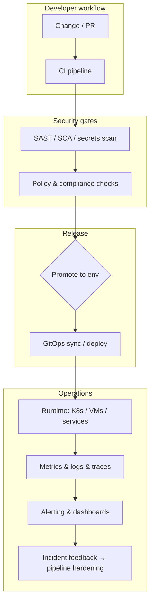

<div align="center">

# 👋 Hi, I'm Keith Onyango

### Platform Engineer • DevSecOps • Cloud & Automation • Reliability-Focused Infrastructure

I design and operate **secure, observable, and automated** platforms across **multi-cloud infrastructure, Kubernetes ecosystems, CI/CD, DevSecOps pipelines, policy-driven guardrails, and AI-assisted operational workflows**.

My work sits at the intersection of **platform engineering, security-by-design delivery, infrastructure as code, GitOps, SRE practices, and production-minded observability**.

<br />

[](https://github.com/KeithOnyango)
[](https://github.com/KeithOnyango)

<br />
<br />


</div>

---

<div align="center">

## Infrastructure engineering with automation, security gates, operational clarity, and production reliability.

</div>

<p align="center">
  <strong>Platform Engineering</strong> •
  <strong>DevSecOps</strong> •
  <strong>Cloud Native (Kubernetes)</strong> •
  <strong>Infrastructure as Code</strong> •
  <strong>GitOps & CI/CD</strong> •
  <strong>Observability & SRE</strong> •
  <strong>AI-Assisted Operations</strong>
</p>

---

## 📌 Proof of Work

<table>
  <tr>
    <td width="25%" align="center" valign="top">
      <h3>End-to-end delivery</h3>
      <p>Hands-on ownership across <strong>IaC</strong>, <strong>pipelines</strong>, <strong>runtime platforms</strong>, and <strong>release automation</strong> — from foundation to production guardrails.</p>
    </td>
    <td width="25%" align="center" valign="top">
      <h3>Security in the loop</h3>
      <p>Shift-left patterns: <strong>container & dependency scanning</strong>, <strong>policy-as-code</strong>, <strong>secrets hygiene</strong>, and <strong>pipeline-integrated controls</strong>.</p>
    </td>
    <td width="25%" align="center" valign="top">
      <h3>Observable systems</h3>
      <p>Metrics, logs, and traces wired for <strong>incident response</strong>, <strong>capacity signals</strong>, and <strong>SLO-minded operations</strong>.</p>
    </td>
    <td width="25%" align="center" valign="top">
      <h3>Multi-cloud foundation</h3>
      <p>Practical experience across <strong>AWS</strong>, <strong>Azure</strong>, and <strong>GCP</strong> patterns — automation-first, repeatable environments.</p>
    </td>
  </tr>
</table>

---

## 🧭 Engineering Identity

I am a **platform and DevSecOps engineer** focused on building internal platforms, hardened delivery pipelines, and operational clarity for teams shipping software safely.

My strength is not only configuring tools. It is **framing the reliability problem**, **automating the path to production**, **embedding security without slowing delivery**, and **making operational signals actionable**.

```txt
Delivery intent
├── Service ownership & production mindset
├── Automation before manual runbooks
├── Guardrails that scale with the team
├── Measurable reliability (SLIs / SLOs where they matter)
├── Documentation teams can trust
└── Continuous reduction of toil
```

---

## 🔐 Repository Direction

Some of my strongest work lives in **private**, **client**, or **pre-release** contexts. This GitHub profile is intentionally evolving into a **public engineering portfolio**.

Here I publish and will continue to publish **reference patterns**, **automation templates**, **architecture notes**, and **implementation examples** spanning **platform engineering, DevSecOps, GitOps, observability, cloud infrastructure, and AI-assisted operations**.

The goal is to show **how I think about reliability and security** — not only which badges appear on a stack diagram.

---

## 🚀 Current Focus

```txt
Portfolio & deep builds (WIP — selective publication)
├── Security observability platforms (SIEM / logging / dashboarding patterns)
├── Brownfield integration architectures (pragmatic, incremental rollout)
├── GitOps & IaC modules reusable across environments
├── Pipeline security gates that teams actually adopt
├── Observability stacks aligned to on-call reality
└── AI-assisted workflows for operational leverage (incl. MCP exploration)
```

**Note:** Several flagship builds are **being prepared for public release** or remain **private until cleared for sharing**. Sections below label **WIP** clearly.

---

## 🧠 System Architecture

### Secure delivery & observability (representative pattern)



This pattern reflects how I approach **defense in depth**, **repeatable promotions**, and **feedback loops** between production signals and delivery quality.

---

## 🧱 Systems I Build

<table>
  <tr>
    <td width="33%" valign="top">
      <h3>Internal Platforms & IDP surfaces</h3>
      <p>
        Self-service infrastructure patterns, paved-road workflows, golden paths, and developer experience improvements backed by automation.
      </p>
      <p><em>Status: portfolio examples — <strong>WIP</strong></em></p>
    </td>
    <td width="33%" valign="top">
      <h3>DevSecOps & supply chain safety</h3>
      <p>
        CI-integrated scanning, container security, policy-as-code, secrets management patterns, and pragmatic compliance automation.
      </p>
    </td>
    <td width="33%" valign="top">
      <h3>Cloud-native runtime foundations</h3>
      <p>
        Kubernetes-centric delivery, GitOps controllers, Helm releases, networking & ingress patterns, and progressive rollout strategies.
      </p>
    </td>
  </tr>

  <tr>
    <td width="33%" valign="top">
      <h3>Observability & SRE practice</h3>
      <p>
        Prometheus/Grafana-style telemetry, centralized logging stacks, tracing hooks, on-call-friendly alerting, and incident-ready dashboards.
      </p>
    </td>
    <td width="33%" valign="top">
      <h3>Security observability integrations</h3>
      <p>
        Enterprise logging pipelines, SIEM-oriented visibility, and unified operational dashboards — especially in brownfield environments.
      </p>
      <p><em>Status: representative builds — <strong>WIP / selective disclosure</strong></em></p>
    </td>
    <td width="33%" valign="top">
      <h3>AI-assisted operations</h3>
      <p>
        LLM-augmented reviews, automation hooks, and experimentation with agent orchestration patterns (e.g. MCP) where they reduce operational load safely.
      </p>
    </td>
  </tr>
</table>

---

## 🔧 Featured Systems & Highlights

<table>
  <tr>
    <td width="50%" valign="top">
      <h3>IaC & platform foundations</h3>
      <p>
        Terraform-first infrastructure modules, environment separation patterns, and repeatable provisioning workflows across cloud providers.
      </p>
      <p>
        <strong>Focus:</strong> IaC structure, state discipline, module boundaries, safe rollouts.
      </p>
      <p>
        <code>Terraform</code> <code>IaC</code> <code>Multi-cloud</code> <code>Automation</code>
      </p>
      <p><em>Public deep-dives — <strong>WIP</strong> (repos being curated)</em></p>
    </td>
    <td width="50%" valign="top">
      <h3>CI/CD & GitOps</h3>
      <p>
        Pipeline design for Jenkins, GitHub Actions, GitLab CI, and Azure DevOps — paired with GitOps delivery where appropriate (e.g. Argo CD–style workflows).
      </p>
      <p>
        <strong>Focus:</strong> delivery speed with guardrails, auditability, and rollback posture.
      </p>
      <p>
        <code>CI/CD</code> <code>GitOps</code> <code>GitHub Actions</code> <code>Release automation</code>
      </p>
    </td>
  </tr>

  <tr>
    <td width="50%" valign="top">
      <h3>Container & Kubernetes operations</h3>
      <p>
        Dockerized workloads, Helm charts, cluster hardening considerations, and pragmatic Day-2 operations.
      </p>
      <p>
        <strong>Focus:</strong> runtime reliability, upgrades, observability hooks, security baselines.
      </p>
      <p>
        <code>Kubernetes</code> <code>Docker</code> <code>Helm</code> <code>GitOps</code>
      </p>
    </td>
    <td width="50%" valign="top">
      <h3>Observability stacks</h3>
      <p>
        Metrics and dashboards (Prometheus / Grafana ecosystem), centralized logging patterns (ELK-aware workflows), and tracing where it earns its cost.
      </p>
      <p>
        <strong>Focus:</strong> signal quality, alert fatigue reduction, incident-ready visibility.
      </p>
      <p>
        <code>Prometheus</code> <code>Grafana</code> <code>Logging</code> <code>Tracing</code>
      </p>
    </td>
  </tr>

  <tr>
    <td width="50%" valign="top">
      <h3>Security tooling integration</h3>
      <p>
        SonarQube, Trivy, Vault, Falco, OPA, Snyk — integrated as part of engineering workflow, not checkbox theatre.
      </p>
      <p>
        <strong>Focus:</strong> actionable findings, pipeline gates that teams tolerate, continuous improvement.
      </p>
      <p>
        <code>DevSecOps</code> <code>Policy</code> <code>Secrets</code> <code>Supply chain</code>
      </p>
    </td>
    <td width="50%" valign="top">
      <h3>Automation & orchestration</h3>
      <p>
        Ansible-style automation, scripted operational procedures, and workflow orchestration (including experimentation with tools like n8n where appropriate).
      </p>
      <p>
        <strong>Focus:</strong> reduce toil, encode repeatability, measurable outcomes.
      </p>
      <p>
        <code>Ansible</code> <code>Automation</code> <code>Python</code> <code>Bash</code>
      </p>
    </td>
  </tr>
</table>

---

## 🧩 Core Engineering Areas

<table>
  <tr>
    <td width="33%" valign="top">
      <h3>Platform Engineering</h3>
      <ul>
        <li>Internal developer platforms & paved roads</li>
        <li>Self-service infra patterns</li>
        <li>Golden paths & templates</li>
        <li>Developer experience improvements</li>
        <li>Operational ownership culture</li>
      </ul>
    </td>
    <td width="33%" valign="top">
      <h3>DevSecOps</h3>
      <ul>
        <li>Shift-left security in CI/CD</li>
        <li>Container & dependency scanning</li>
        <li>Policy-as-code (OPA / Kyverno mindset)</li>
        <li>Secrets management patterns</li>
        <li>Compliance-minded automation</li>
      </ul>
    </td>
    <td width="33%" valign="top">
      <h3>Cloud & Infrastructure</h3>
      <ul>
        <li>AWS / Azure / GCP foundations</li>
        <li>Terraform-centric IaC</li>
        <li>Networking & identity-aware design</li>
        <li>Cost-aware scaling & FinOps instincts</li>
        <li>Multi-environment promotion patterns</li>
      </ul>
    </td>
  </tr>

  <tr>
    <td width="33%" valign="top">
      <h3>Kubernetes & GitOps</h3>
      <ul>
        <li>Cluster delivery & upgrades</li>
        <li>Helm releases & rollbacks</li>
        <li>GitOps controllers & sync strategies</li>
        <li>Ingress & service exposure patterns</li>
        <li>Progressive delivery considerations</li>
      </ul>
    </td>
    <td width="33%" valign="top">
      <h3>Observability & SRE</h3>
      <ul>
        <li>Metrics, logs, traces — pragmatic adoption</li>
        <li>Alert design & noise control</li>
        <li>Incident-ready dashboards</li>
        <li>SLO thinking where it matters</li>
        <li>Post-incident pipeline feedback</li>
      </ul>
    </td>
    <td width="33%" valign="top">
      <h3>Automation & scripting</h3>
      <ul>
        <li>Python & Go for tooling</li>
        <li>Bash / PowerShell operational scripts</li>
        <li>YAML discipline at scale</li>
        <li>Workflow orchestration experiments</li>
        <li>AI-assisted ops where safe</li>
      </ul>
    </td>
  </tr>
</table>

---

## 🛠️ Languages, Tools & Technologies

<div align="center">

### Core languages & scripting


<br />
<br />


<br />
<br />

### Cloud & IaC


<br />
<br />

### Kubernetes & containers


<br />
<br />

### CI/CD


<br />
<br />

### Security & DevSecOps


<br />
<br />

### Observability


<br />
<br />

### AI / automation interest


<br />
<br />

### Workflow


</div>

---

## 🧠 Architecture Decision Style

```txt
When designing platforms and pipelines, I usually think through:

Risk & threat model
├── What must never leak or ship insecure?
├── Where are the human bottlenecks?
├── What breaks first under load or incident volume?

Delivery physics
├── What is environments × pipelines × blast radius?
├── What belongs in Git vs runtime configuration?
├── What should be synchronous vs asynchronous?

Operations & feedback
├── What signals prove health vs vanity metrics?
├── What alerts wake people up — and should they?
├── What does “done” mean after deploy (Day 2)?
```

---

## 🧱 Engineering Principles

<table>
  <tr>
    <td width="50%" valign="top">
      <h3>Automation with accountability</h3>
      <p>
        Automate repetition; keep humans in the loop for judgment calls and irreversible actions — encode approvals where needed.
      </p>
    </td>
    <td width="50%" valign="top">
      <h3>Security as a throughput problem</h3>
      <p>
        Controls should increase confidence without destroying velocity — noisy gates get bypassed culturally.
      </p>
    </td>
  </tr>

  <tr>
    <td width="50%" valign="top">
      <h3>Observable by default</h3>
      <p>
        If we cannot detect failure modes quickly, we cannot claim reliability — telemetry is part of the feature set.
      </p>
    </td>
    <td width="50%" valign="top">
      <h3>Practical FinOps instincts</h3>
      <p>
        Scale when justified; optimize waste continuously; align spend to customer-visible reliability.
      </p>
    </td>
  </tr>
</table>

---

## 📊 GitHub Overview

<div align="center">


<br />
<br />


<br />
<br />


</div>

---

## 📈 Live Contribution Activity

<div align="center">


</div>

---

### ⏱️ Coding activity (Wakatime)

[](https://wakatime.com/@XpertKenaTion)

---

## 🌍 Selected Directions & Builds

<table>
  <tr>
    <td width="33%" valign="top">
      <h3>Enterprise security visibility</h3>
      <p>
        Centralized logging, SIEM-oriented visibility, and operator-first dashboards for complex brownfield integrations.
      </p>
      <p><em><strong>WIP</strong> — publication pending clearance / packaging</em></p>
    </td>
    <td width="33%" valign="top">
      <h3>Platform automation catalog</h3>
      <p>
        Reusable Terraform modules, pipeline templates, and GitOps patterns intended as open references.
      </p>
      <p><em><strong>WIP</strong> — repos being curated for public release</em></p>
    </td>
    <td width="33%" valign="top">
      <h3>AI-augmented operations</h3>
      <p>
        Practical experimentation with agent orchestration (incl. MCP) where it improves reviews, runbooks, or automation safely.
      </p>
    </td>
  </tr>
</table>

---

## 📌 Experience Snapshot

```txt
Focus areas:
├── Platform engineering & internal platforms
├── DevSecOps & secure software supply chain
├── Multi-cloud infrastructure (AWS / Azure / GCP)
├── Kubernetes, containers, GitOps
├── CI/CD excellence & release automation
├── Observability, alerting, incident-ready operations
├── Infrastructure as Code (Terraform-forward)
└── AI-assisted operational leverage (where appropriate)
```

---

## 🏆 Certifications & Learning Path

```text
🎓 Pursuing / target certifications:
   ├─ AWS Certified Solutions Architect – Professional
   ├─ Certified Kubernetes Security Specialist (CKS)
   ├─ HashiCorp Certified: Terraform Associate
   ├─ Certified Kubernetes Administrator (CKA)
   └─ GitHub Advanced Security Certification

🌱 Continuous learning:
   ├─ Platform engineering & IDP patterns
   ├─ eBPF for observability & security
   ├─ WASM at the edge (selective use cases)
   ├─ Supply chain security (SLSA, Sigstore)
   └─ AI/ML operations & LLMOps interfaces to platforms
```

---

## 🤝 Open To

<table>
  <tr>
    <td width="50%" valign="top">
      <strong>Platform / DevOps / Cloud Engineering roles</strong>
      <br />
      Building internal platforms, IaC foundations, automated delivery, and production-ready infrastructure.
    </td>
    <td width="50%" valign="top">
      <strong>DevSecOps & secure delivery roles</strong>
      <br />
      Embedding security into pipelines, Kubernetes guardrails, policy automation, and pragmatic compliance.
    </td>
  </tr>

  <tr>
    <td width="50%" valign="top">
      <strong>SRE & observability-heavy roles</strong>
      <br />
      Reliability engineering with metrics, alerts, incident practice, and operational maturity.
    </td>
    <td width="50%" valign="top">
      <strong>Infrastructure architecture & consulting</strong>
      <br />
      Brownfield modernization, GitOps adoption, and measurable reliability improvements.
    </td>
  </tr>
</table>

---

## 📫 Contact

<div align="center">

### Let’s connect around platform engineering, DevSecOps, cloud infrastructure, Kubernetes, CI/CD, observability, and AI-assisted operations.

<br />

📧 [keith.onyango1@gmail.com](mailto:keith.onyango1@gmail.com)

<br />
<br />

<a href="https://www.linkedin.com/in/keithonyango/">LinkedIn</a> •
<a href="https://github.com/KeithOnyango">GitHub</a> •
<a href="mailto:keith.onyango1@gmail.com">Email</a>

</div>

---

<div align="center">


### Automate with intent. Secure by design. Observe what matters.

</div>
