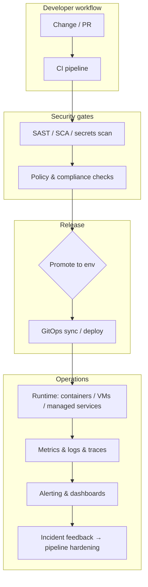

<!--
  Profile assets: profile/*.svg on branch develop (repo default).
  Refresh stats: Actions → "Update README stats cards"
  Verify banner: https://raw.githubusercontent.com/KeithOnyango/KeithOnyango/develop/profile/banner.svg
-->

<div align="center">

**DevSecOps & Platform engineer** — I build **secure CI/CD pipelines**, **multi-cloud Terraform/IaC**, **observable cloud-native runtimes**, **VAPT-informed hardening**, and **guardrailed AI ops interfaces** for teams shipping to production.

<br />

[LinkedIn](https://www.linkedin.com/in/keithonyango/) · [Email](mailto:keithonyango1@gmail.com) · [AI Engineer](https://github.com/KeithOnyango/AI_Engineer) · [Homelab stack](https://github.com/KeithOnyango/homelab_vps_tools)

<br />

[](https://github.com/KeithOnyango)
[](https://github.com/KeithOnyango)

<br />

<a href="https://github.com/KeithOnyango">
  
</a>

</div>

---

## Currently building

- **AI Engineer** — AI/ML integration notes, Cursor agent-skills lifecycle, Ollama, n8n, and BMAD-aligned engineering workflows.
- **Public portfolio patterns** — Terraform modules, GitOps templates, and DevSecOps pipeline gates (repos being curated for release)
- **Enterprise security visibility** — brownfield logging, SIEM-oriented dashboards, operator-first observability.

> Strongest production work lives in **private/client** contexts. This profile shows **how I work** and **what I publish openly** — not every deployment.

---

## Selected work

| Project | What it is | Status |
|---------|------------|--------|
|  AI_Engineer| AI engineering lab: agent-skills, Ollama, ECC, automation patterns, Cursor setup | Active |
|  homelab_vps_tools  | Self-hosted homelab: n8n, observability, VPS, SSO, Security etc | Active |
| Claude_code_guide | Claude Code bundle: agents, BMAD commands, awesome-claude-skills collections | Active |
| Platform IaC catalog | Reusable Terraform modules + CI/CD templates across AWS/Azure/GCP | Active |
| Enterprise SIEM / visibility | Centralized logging and security dashboards for brownfield integrations | Active |

---

## How I work

I operate at the intersection of **Platform engineering**, **DevSecOps**, **SRE/observability**, **VAPT-informed delivery**, and **AI product surfaces that ship with guardrails** — not hype-first demos.

```txt
Delivery intent
├── Threat-aware design (VAPT lens → practical mitigations)
├── Automation before fragile runbooks
├── Guardrails teams actually adopt
├── Measurable reliability (SLIs / SLOs where they earn trust)
└── Documentation operators can run at 3am
```

### Secure delivery loop (representative)



| Principle | In practice |
|-----------|-------------|
| Security as throughput | Pipeline gates that teams tolerate — noisy controls get bypassed culturally |
| Observable by default | Telemetry is part of the feature set, not a Phase 2 afterthought |
| Automation with accountability | Humans stay in the loop for irreversible actions |
| Defense in depth, verified | Prevent + detect + respond — incidents feed back into delivery |

**Stack (when it matters):** Terraform · GitHub Actions / GitLab CI / Jenkins · Docker · Prometheus/Grafana · AWS/Azure/GCP · Python/Go/Bash · OPA/Trivy/Vault-class tooling · bounded LLM/MCP automation

---

## Open to

| Area | Focus |
|------|--------|
| **Platform / cloud engineering** | Internal platforms, IaC, paved roads, production-ready multi-cloud |
| **DevSecOps & secure delivery** | Supply chain safety, policy-as-code, pragmatic compliance |
| **AI product engineering** | Guardrailed AI workflows with observability and operator ownership |
| **Security assessment (VAPT) / AppSec** | Findings → prioritized, verifiable engineering backlog |
| **SRE & observability** | SLIs/SLOs, alert design, incident-ready operations |

---

## Contact

<div align="center">

📧 [keithonyango1@gmail.com](mailto:keithonyango1@gmail.com) · [LinkedIn](https://www.linkedin.com/in/keithonyango/) · [GitHub](https://github.com/KeithOnyango)

<!-- <br />


<br /> -->

<!-- <sub>Stats generated into <code>profile/*.svg</code> via GitHub Actions · <a href="https://github.com/KeithOnyango/KeithOnyango/blob/develop/.github/workflows/update-readme-stats.yml">workflow</a></sub> -->

</div>

---

<div align="center">

### Automate with intent. Secure by design. Observe what matters.

</div>
