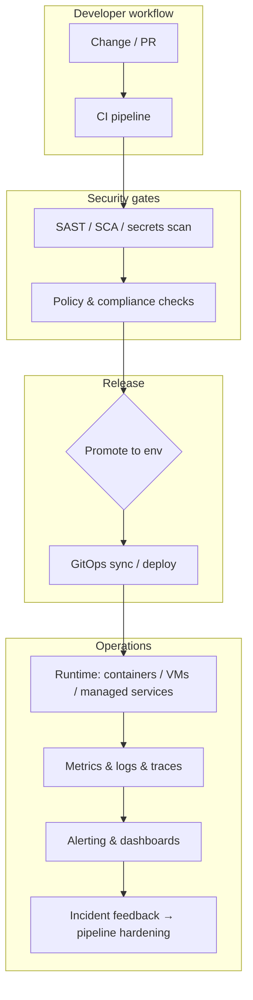

<div align="center">

# 👋 Hi, I'm Keith Onyango

### DevSecOps Engineer • Platform Engineer • AI Product Engineer • Security Analyst (VAPT)

I design and operate **secure, observable, and automated** platforms across **multi-cloud infrastructure, delivery pipelines, DevSecOps guardrails, cloud-native runtimes, security assessment workflows, and AI-assisted product & operations interfaces**.

My work sits at the intersection of **platform engineering, security-by-design delivery, infrastructure as code, GitOps, reliability practices, AI product surfaces that ship safely, and hands-on vulnerability assessment thinking**.

<br />

[](https://github.com/KeithOnyango)
[](https://github.com/KeithOnyango)

<br />
<br />


</div>

---

<div align="center">

## Platform and product engineering with security gates, operational clarity, automation, and production reliability.

</div>

<p align="center">
  <strong>DevSecOps</strong> •
  <strong>Platform Engineering</strong> •
  <strong>AI Product Engineering</strong> •
  <strong>Security Analyst (VAPT)</strong> •
  <strong>Cloud-Native Infrastructure</strong> •
  <strong>GitOps & CI/CD</strong> •
  <strong>Observability & SRE</strong> •
  <strong>Secure Delivery</strong>
</p>

---

## 📌 Proof of Work

<table>
  <tr>
    <td width="25%" align="center" valign="top">
      <h3>End-to-end delivery</h3>
      <p>Hands-on ownership across <strong>IaC</strong>, <strong>pipelines</strong>, <strong>runtime platforms</strong>, and <strong>release automation</strong> — from foundation to production guardrails.</p>
      <p><em>Public portfolio — <strong>expanding (WIP)</strong></em></p>
    </td>
    <td width="25%" align="center" valign="top">
      <h3>Security in the loop</h3>
      <p>Shift-left patterns: <strong>container & dependency scanning</strong>, <strong>policy-as-code</strong>, <strong>secrets hygiene</strong>, <strong>pipeline-integrated controls</strong>, and <strong>VAPT-informed hardening</strong>.</p>
    </td>
    <td width="25%" align="center" valign="top">
      <h3>Observable systems</h3>
      <p>Metrics, logs, and traces wired for <strong>incident response</strong>, <strong>capacity signals</strong>, and <strong>SLO-minded operations</strong>.</p>
    </td>
    <td width="25%" align="center" valign="top">
      <h3>Multi-cloud foundation</h3>
      <p>Practical experience across <strong>AWS</strong>, <strong>Azure</strong>, and <strong>GCP</strong> — automation-first, repeatable environments and promotions.</p>
    </td>
  </tr>
</table>

---

## 🧭 Engineering Identity

I am a **DevSecOps and platform engineer**, **AI product-minded builder**, and **security analyst (VAPT)** focused on internal platforms, hardened delivery pipelines, operational clarity, and safe AI-assisted workflows for teams shipping software.

My strength is not only configuring tools. It is **framing risk and reliability**, **automating the path to production**, **embedding security without destroying velocity**, **reasoning about exploitable failure modes**, and **making operational signals actionable**.

Before highlighting any single runtime, I default to **cloud-native patterns** — containers, managed services, networking, identity, and progressive delivery — with **security and observability** treated as part of the product surface.

```txt
Delivery intent
├── Threat-aware design (VAPT lens → practical mitigations)
├── Automation before fragile runbooks
├── Guardrails that teams actually adopt
├── Measurable reliability (SLIs / SLOs where they earn trust)
├── Documentation operators can run at 3am
└── Continuous reduction of toil
```

---

## 🔐 Repository Direction

Some of my strongest work lives in **private**, **client**, or **pre-release** contexts. This GitHub profile is intentionally evolving into a **public engineering portfolio**.

Here I publish and will continue to publish **reference patterns**, **automation templates**, **architecture notes**, and **implementation examples** spanning **platform engineering, DevSecOps, GitOps, observability, multi-cloud infrastructure, security visibility, and AI-assisted operations**.

The goal is to show **how I think about reliability and security** — not only which badges appear on a stack diagram. Several flagship builds are **WIP** or **awaiting clearance** for public linking; sections below label that clearly.

---

## 🚀 Current Focus

```txt
Portfolio & deep builds (WIP — selective publication)
├── Security observability platforms (logging / SIEM / dashboarding patterns)
├── Brownfield integration architectures (incremental, production-safe rollout)
├── GitOps & IaC modules reusable across environments
├── Pipeline security gates that teams tolerate and adopt
├── Observability stacks aligned to on-call reality
├── AI product interfaces & workflow automation (safe-by-default posture)
└── VAPT-driven insights translated into engineering backlog items
```

**Note:** Multiple end-to-end systems are **being curated for public release** or remain **private until cleared for sharing**. Proof-of-work metrics above emphasize **how I work**; quantitative case studies will surface as repos go public.

---

## 🧠 System Architecture

### Secure delivery & observability (representative pattern)



This pattern reflects **defense in depth**, **repeatable promotions**, and **feedback loops** between production signals and delivery quality — without tying the story to a single orchestrator technology.

---

## 🧱 Systems I Build

<table>
  <tr>
    <td width="33%" valign="top">
      <h3>Internal platforms & paved roads</h3>
      <p>
        Self-service infrastructure patterns, golden-path workflows, and developer experience improvements backed by automation.
      </p>
      <p><em>Status: portfolio examples — <strong>WIP</strong></em></p>
    </td>
    <td width="33%" valign="top">
      <h3>DevSecOps & supply chain safety</h3>
      <p>
        CI-integrated scanning, container security, policy-as-code, secrets patterns, and pragmatic compliance automation.
      </p>
    </td>
    <td width="33%" valign="top">
      <h3>Cloud-native runtimes & delivery</h3>
      <p>
        Containerized workloads, progressive rollout strategies, GitOps-style delivery, networking & ingress patterns — framed around reliability and security outcomes (not a single vendor story).
      </p>
    </td>
  </tr>

  <tr>
    <td width="33%" valign="top">
      <h3>Observability & SRE practice</h3>
      <p>
        Prometheus/Grafana-style telemetry, centralized logging stacks, tracing where it earns its cost, on-call-friendly alerting, and incident-ready dashboards.
      </p>
    </td>
    <td width="33%" valign="top">
      <h3>Security visibility & assessment</h3>
      <p>
        Enterprise logging / SIEM-oriented visibility, operator-first dashboards, and <strong>VAPT</strong>-informed recommendations mapped to practical fixes.
      </p>
      <p><em>Status: representative builds — <strong>WIP / selective disclosure</strong></em></p>
    </td>
    <td width="33%" valign="top">
      <h3>AI product & automation surfaces</h3>
      <p>
        LLM-augmented workflows, routing and guardrail thinking, and experimentation with orchestration (e.g. MCP) where it reduces load without increasing risk.
      </p>
    </td>
  </tr>
</table>

---

## 🔧 Featured Systems & Highlights

<table>
  <tr>
    <td width="50%" valign="top">
      <h3>IaC & platform foundations</h3>
      <p>
        Terraform-first infrastructure modules, environment separation patterns, and repeatable provisioning workflows across cloud providers.
      </p>
      <p>
        <strong>Focus:</strong> IaC structure, state discipline, module boundaries, safe rollouts.
      </p>
      <p>
        <code>Terraform</code> <code>IaC</code> <code>Multi-cloud</code> <code>Automation</code>
      </p>
      <p><em>Public deep-dives — <strong>WIP</strong> (repos being curated)</em></p>
    </td>
    <td width="50%" valign="top">
      <h3>CI/CD & GitOps</h3>
      <p>
        Pipeline design for Jenkins, GitHub Actions, GitLab CI, and Azure DevOps — paired with GitOps delivery where it fits the team.
      </p>
      <p>
        <strong>Focus:</strong> delivery speed with guardrails, auditability, rollback posture.
      </p>
      <p>
        <code>CI/CD</code> <code>GitOps</code> <code>GitHub Actions</code> <code>Release automation</code>
      </p>
    </td>
  </tr>

  <tr>
    <td width="50%" valign="top">
      <h3>Container & runtime operations</h3>
      <p>
        Dockerized workloads, Helm-oriented releases where appropriate, upgrades, observability hooks, and security baselines — framed as **production operations**, not buzzwords.
      </p>
      <p>
        <strong>Focus:</strong> reliability, safe change management, measurable Day-2 ownership.
      </p>
      <p>
        <code>Docker</code> <code>Helm</code> <code>GitOps</code> <code>Containers</code>
      </p>
    </td>
    <td width="50%" valign="top">
      <h3>Observability stacks</h3>
      <p>
        Metrics and dashboards (Prometheus / Grafana ecosystem), centralized logging patterns (ELK-aware workflows), and tracing where justified.
      </p>
      <p>
        <strong>Focus:</strong> signal quality, alert fatigue reduction, incident-ready visibility.
      </p>
      <p>
        <code>Prometheus</code> <code>Grafana</code> <code>Logging</code> <code>Tracing</code>
      </p>
    </td>
  </tr>

  <tr>
    <td width="50%" valign="top">
      <h3>Security tooling integration</h3>
      <p>
        SonarQube, Trivy, Vault, Falco, OPA, Snyk — integrated into engineering workflow as actionable signals, not checkbox theatre.
      </p>
      <p>
        <strong>Focus:</strong> pipeline gates teams tolerate, continuous improvement.
      </p>
      <p>
        <code>DevSecOps</code> <code>Policy</code> <code>Secrets</code> <code>Supply chain</code>
      </p>
    </td>
    <td width="50%" valign="top">
      <h3>Automation & orchestration</h3>
      <p>
        Ansible-style automation, scripted operational procedures, and workflow orchestration (including tools like n8n where appropriate).
      </p>
      <p>
        <strong>Focus:</strong> reduce toil, encode repeatability, measurable outcomes.
      </p>
      <p>
        <code>Ansible</code> <code>Automation</code> <code>Python</code> <code>Bash</code>
      </p>
    </td>
  </tr>

  <tr>
    <td width="50%" valign="top">
      <h3>Enterprise security visibility (brownfield)</h3>
      <p>
        Centralized logging, SIEM-oriented patterns, and operator-first dashboards for complex integrations — typical of regulated or high-signal environments.
      </p>
      <p>
        <strong>Focus:</strong> pragmatic rollout, evidence operators trust, sustainable operations.
      </p>
      <p>
        <code>SIEM</code> <code>Logging</code> <code>Dashboards</code> <code>Brownfield</code>
      </p>
      <p><em><strong>WIP</strong> — publication pending clearance / packaging</em></p>
    </td>
    <td width="50%" valign="top">
      <h3>AI-assisted operations (guardrailed)</h3>
      <p>
        Practical use of LLM-assisted reviews, runbooks, and orchestration experiments — with explicit boundaries so automation never becomes unowned risk.
      </p>
      <p>
        <strong>Focus:</strong> leverage without loosening change management.
      </p>
      <p>
        <code>LLM</code> <code>MCP</code> <code>Automation</code> <code>Human-in-the-loop</code>
      </p>
    </td>
  </tr>
</table>

---

## 🧩 Core Engineering Areas

<table>
  <tr>
    <td width="33%" valign="top">
      <h3>Platform Engineering</h3>
      <ul>
        <li>Internal developer platforms & paved roads</li>
        <li>Self-service infrastructure patterns</li>
        <li>Golden paths & templates</li>
        <li>Developer experience improvements</li>
        <li>Operational ownership culture</li>
        <li>Production readiness & promotion discipline</li>
        <li>Runbooks that survive incidents</li>
        <li>Cost-aware scaling instincts</li>
      </ul>
    </td>
    <td width="33%" valign="top">
      <h3>DevSecOps</h3>
      <ul>
        <li>Shift-left security in CI/CD</li>
        <li>Container & dependency scanning</li>
        <li>Policy-as-code (OPA / Kyverno mindset)</li>
        <li>Secrets management patterns</li>
        <li>Compliance-minded automation</li>
        <li>Supply chain & artifact provenance thinking</li>
        <li>Tooling noise → actionable backlog</li>
        <li>Security as throughput, not friction theater</li>
      </ul>
    </td>
    <td width="33%" valign="top">
      <h3>Cloud & Infrastructure</h3>
      <ul>
        <li>AWS / Azure / GCP foundations</li>
        <li>Terraform-centric IaC</li>
        <li>Networking & identity-aware design</li>
        <li>Multi-environment promotion patterns</li>
        <li>Cloud-native runtimes (generic posture)</li>
        <li>Managed services & hybrid patterns</li>
        <li>Disaster recovery & backup thinking</li>
        <li>FinOps-aware defaults</li>
      </ul>
    </td>
  </tr>

  <tr>
    <td width="33%" valign="top">
      <h3>Observability & SRE</h3>
      <ul>
        <li>Metrics, logs, traces — pragmatic adoption</li>
        <li>Alert design & noise control</li>
        <li>Incident-ready dashboards</li>
        <li>SLO thinking where it earns trust</li>
        <li>Post-incident pipeline feedback</li>
        <li>On-call empathy & clear escalation paths</li>
        <li>Capacity & performance signals</li>
        <li>Learning reviews that change systems</li>
      </ul>
    </td>
    <td width="33%" valign="top">
      <h3>Security assessment (VAPT mindset)</h3>
      <ul>
        <li>Risk-prioritized findings → engineering tasks</li>
        <li>Web & API attack surface awareness</li>
        <li>Secure configuration baselines</li>
        <li>Evidence-driven reporting for stakeholders</li>
        <li>Collaboration with dev teams on fixes</li>
        <li>Validation & retest discipline</li>
        <li>Threat modeling in brownfield systems</li>
        <li>Practical hardening over checklist vanity</li>
      </ul>
    </td>
    <td width="33%" valign="top">
      <h3>AI Product & Automation</h3>
      <ul>
        <li>AI product interfaces grounded in real workflows</li>
        <li>Provider abstraction & routing guardrails</li>
        <li>Human approval for sensitive actions</li>
        <li>Operational automation (reduce toil safely)</li>
        <li>MCP / agent experiments where bounded</li>
        <li>Prompt & tool policy hygiene</li>
        <li>Observability for AI-assisted workflows</li>
        <li>Documentation for safe adoption</li>
      </ul>
    </td>
  </tr>

  <tr>
    <td width="33%" valign="top">
      <h3>CI/CD & GitOps</h3>
      <ul>
        <li>GitHub Actions, GitLab CI, Jenkins, Azure DevOps</li>
        <li>Progressive delivery patterns</li>
        <li>GitOps sync strategies where appropriate</li>
        <li>Rollback & blast-radius containment</li>
        <li>Secrets in CI done responsibly</li>
        <li>Environments as contracts</li>
        <li>Release auditing</li>
        <li>Pipeline-as-product thinking</li>
      </ul>
    </td>
    <td width="33%" valign="top">
      <h3>Automation & scripting</h3>
      <ul>
        <li>Python & Go for tooling</li>
        <li>Bash / PowerShell operational scripts</li>
        <li>YAML discipline at scale</li>
        <li>Workflow orchestration across teams</li>
        <li>Idempotent operational procedures</li>
        <li>API-driven infrastructure tasks</li>
        <li>Encoding tribal knowledge</li>
        <li>Testing harnesses for infra changes</li>
      </ul>
    </td>
    <td width="33%" valign="top">
      <h3>Technical Operations</h3>
      <ul>
        <li>Cross-functional support under pressure</li>
        <li>Operational process improvement</li>
        <li>Documentation engineers trust</li>
        <li>Knowledge transfer & pairing</li>
        <li>Vendor evaluation with security lens</li>
        <li>Business continuity awareness</li>
        <li>Records & evidence for audits</li>
        <li>Calm communication during incidents</li>
      </ul>
    </td>
  </tr>
</table>

---

## 🛠️ Languages, Tools & Technologies

<div align="center">

### Core languages & scripting


<br />
<br />


<br />
<br />

### Frontend Engineering


<br />
<br />


<br />
<br />

### Backend Engineering


<br />
<br />


<br />
<br />

### Databases, Data & Analytics


<br />
<br />


<br />
<br />

### Cloud, DevOps & Infrastructure


<br />
<br />


<br />
<br />


<br />
<br />

### Security & observability (tooling)


<br />
<br />


<br />
<br />

### AI, Automation & Product Infrastructure


<br />
<br />

### Tools & Engineering Workflow


<br />
<br />


</div>

---

## 🧠 Architecture Decision Style

```txt
When designing platforms, pipelines, and security posture, I usually think through:

Risk & threat model
├── What must never leak or ship insecure?
├── What is the realistic attack surface (incl. APIs & configs)?
├── Where are human bottlenecks and irreversible actions?

Delivery physics
├── What is environments × pipelines × blast radius?
├── What belongs in Git vs runtime configuration?
├── What should be synchronous vs asynchronous?

Operations & feedback
├── What signals prove health vs vanity metrics?
├── What alerts wake people up — and should they?
├── What does “done” mean after deploy (Day 2)?
```

---

## 🧱 Engineering Principles

<table>
  <tr>
    <td width="50%" valign="top">
      <h3>Automation with accountability</h3>
      <p>
        Automate repetition; keep humans in the loop for judgment calls and irreversible actions — encode approvals where needed.
      </p>
    </td>
    <td width="50%" valign="top">
      <h3>Security as a throughput problem</h3>
      <p>
        Controls should increase confidence without destroying velocity — noisy gates get bypassed culturally.
      </p>
    </td>
  </tr>

  <tr>
    <td width="50%" valign="top">
      <h3>Observable by default</h3>
      <p>
        If we cannot detect failure modes quickly, we cannot claim reliability — telemetry is part of the feature set.
      </p>
    </td>
    <td width="50%" valign="top">
      <h3>Practical FinOps instincts</h3>
      <p>
        Scale when justified; optimize waste continuously; align spend to customer-visible reliability.
      </p>
    </td>
  </tr>

  <tr>
    <td width="50%" valign="top">
      <h3>Defense in depth, verified</h3>
      <p>
        Combine preventive controls with detection and response — and close the loop when incidents teach us something new.
      </p>
    </td>
    <td width="50%" valign="top">
      <h3>Calm clarity under pressure</h3>
      <p>
        Incidents are system tests for communication and documentation — runbooks should survive the people who wrote them being offline.
      </p>
    </td>
  </tr>
</table>

---

## 📊 GitHub Overview

<div align="center">


<br />
<br />


<br />
<br />


</div>

---

## 📈 Live Contribution Activity

<div align="center">


</div>

---

### ⏱️ Coding activity (Wakatime)

[](https://wakatime.com/@XpertKenaTion)

---

## 🌍 Selected Directions & Builds

<table>
  <tr>
    <td width="33%" valign="top">
      <h3>Enterprise security visibility</h3>
      <p>
        Centralized logging, SIEM-oriented visibility, and operator-first dashboards for complex brownfield integrations.
      </p>
      <p><em><strong>WIP</strong> — publication pending clearance / packaging</em></p>
    </td>
    <td width="33%" valign="top">
      <h3>Platform automation catalog</h3>
      <p>
        Reusable Terraform modules, pipeline templates, and GitOps patterns intended as open references.
      </p>
      <p><em><strong>WIP</strong> — repos being curated for public release</em></p>
    </td>
    <td width="33%" valign="top">
      <h3>AI-augmented operations</h3>
      <p>
        Practical experimentation with agent orchestration (incl. MCP) where it improves reviews, runbooks, or automation safely.
      </p>
    </td>
  </tr>

  <tr>
    <td width="33%" valign="top">
      <h3>VAPT-driven engineering backlog</h3>
      <p>
        Turning assessment findings into prioritized, verifiable fixes — bridging security analysis and shipping discipline.
      </p>
    </td>
    <td width="33%" valign="top">
      <h3>Developer platform UX</h3>
      <p>
        Golden paths and templates that reduce cognitive load while preserving guardrails — platforms should feel obvious, not ornate.
      </p>
      <p><em><strong>WIP</strong> — examples being prepared</em></p>
    </td>
    <td width="33%" valign="top">
      <h3>Multi-cloud reliability patterns</h3>
      <p>
        Promotion models, environment parity, and operational signals that hold up when traffic and incidents arrive together.
      </p>
    </td>
  </tr>
</table>

---

## 📌 Experience Snapshot

```txt
Focus areas:
├── DevSecOps & secure software supply chain
├── Platform engineering & internal platforms
├── AI product engineering (guardrailed, operator-aware)
├── Security analysis & VAPT-informed remediation
├── Multi-cloud infrastructure (AWS / Azure / GCP)
├── Cloud-native delivery (containers, GitOps, progressive rollout)
├── CI/CD excellence & release automation
├── Observability, alerting, incident-ready operations
├── Infrastructure as Code (Terraform-forward)
└── AI-assisted operational leverage (bounded, owned, observable)
```

---

## 🏆 Certifications & Learning Path

```text
🎓 Pursuing / target certifications:
   ├─ AWS Certified Solutions Architect – Professional
   ├─ Certified Kubernetes Security Specialist (CKS)
   ├─ HashiCorp Certified: Terraform Associate
   ├─ Certified Kubernetes Administrator (CKA)
   └─ GitHub Advanced Security Certification

🌱 Continuous learning:
   ├─ Platform engineering & IDP patterns
   ├─ eBPF for observability & security
   ├─ WASM at the edge (selective use cases)
   ├─ Supply chain security (SLSA, Sigstore)
   └─ AI/ML operations & LLMOps interfaces to platforms
```

---

## 🤝 Open To

<table>
  <tr>
    <td width="50%" valign="top">
      <strong>Platform / Cloud / Infrastructure Engineering roles</strong>
      <br />
      Building internal platforms, IaC foundations, automated delivery, and production-ready infrastructure across clouds.
    </td>
    <td width="50%" valign="top">
      <strong>DevSecOps & secure delivery roles</strong>
      <br />
      Embedding security into pipelines, policy automation, supply chain safety, and pragmatic compliance.
    </td>
  </tr>

  <tr>
    <td width="50%" valign="top">
      <strong>AI Product Engineering roles</strong>
      <br />
      Shipping AI-assisted workflows and interfaces with guardrails, observability, and operator ownership — not hype-first demos.
    </td>
    <td width="50%" valign="top">
      <strong>Security assessment (VAPT) & AppSec-oriented roles</strong>
      <br />
      Hands-on testing mindset paired with engineering remediation — evidence, prioritization, and measurable risk reduction.
    </td>
  </tr>

  <tr>
    <td width="50%" valign="top">
      <strong>SRE & observability-heavy roles</strong>
      <br />
      Reliability engineering with metrics, alerts, incident practice, and operational maturity.
    </td>
    <td width="50%" valign="top">
      <strong>Infrastructure architecture & consulting</strong>
      <br />
      Brownfield modernization, GitOps adoption, and measurable reliability improvements.
    </td>
  </tr>
</table>

---

## 📫 Contact

<div align="center">

### Let’s connect around DevSecOps, platform engineering, cloud infrastructure, AI product engineering, security assessment (VAPT), CI/CD, observability, and reliable automation.

<br />

📧 [keith.onyango1@gmail.com](mailto:keith.onyango1@gmail.com)

<br />
<br />

<a href="https://www.linkedin.com/in/keithonyango/">LinkedIn</a> •
<a href="https://github.com/KeithOnyango">GitHub</a> •
<a href="mailto:keith.onyango1@gmail.com">Email</a>

</div>

---

<div align="center">


### Automate with intent. Secure by design. Observe what matters.

</div>
